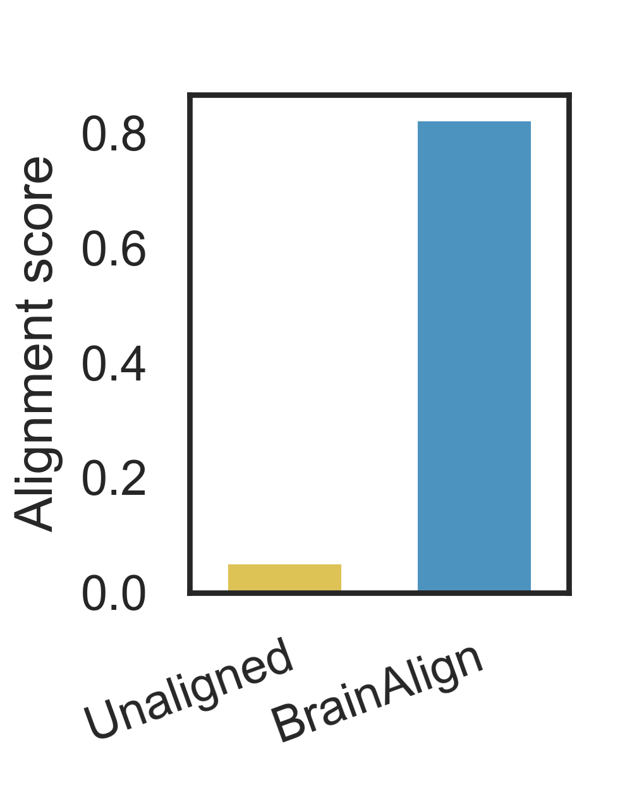
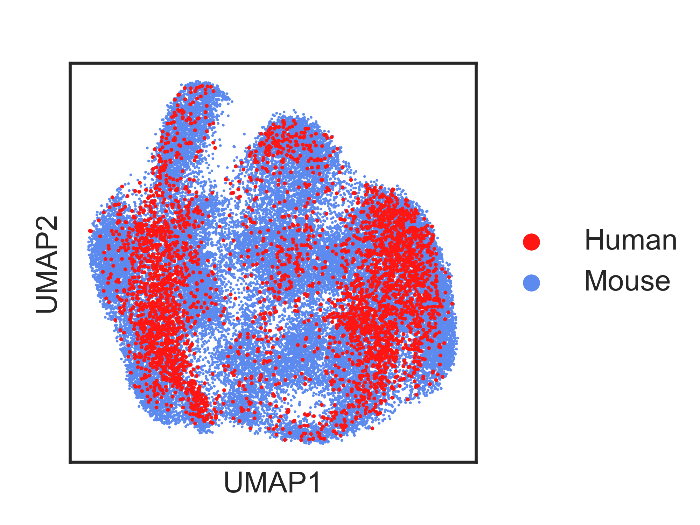
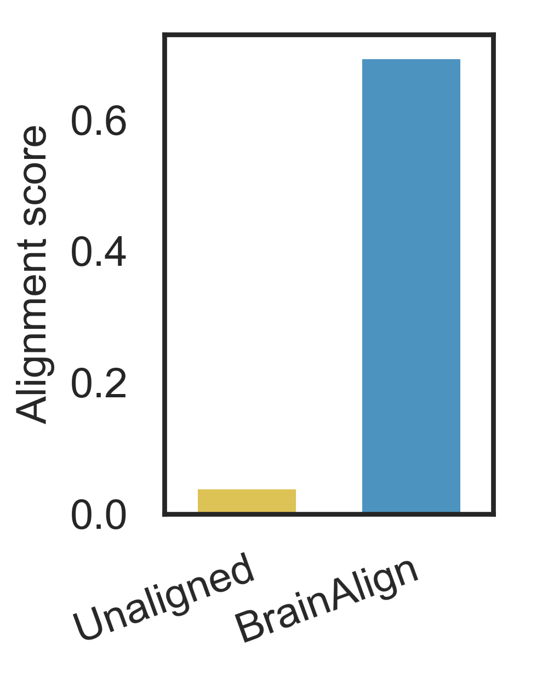
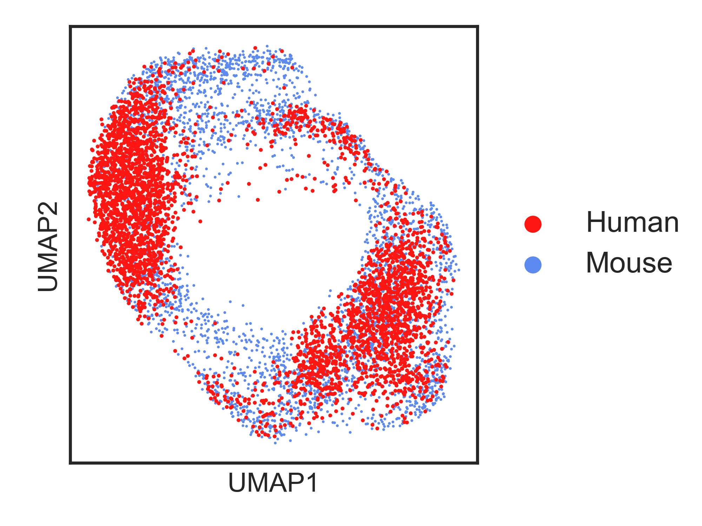

The source code of paper 'Whole Brain Alignment of Spatial Transcriptomics between Humans and Mice with BrainAlign'

# BrainAlign

[](https://opensource.org/licenses/MIT-2.0)

`BrainAlign` is a Python package containing tools for independence testing using multiscale graph correlation and other statistical tests, that is capable of dealing with high dimensional and multivariate data.

- [Overview](#overview)
- [Documentation](#documentation)
- [System Requirements](#system-requirements)
- [Installation Guide](#installation-guide)
- [Setting up the development environment](#setting-up-the-development-environment)
- [License](#license)
- [Issues](https://github.com/neurodata/mgcpy/issues)

# Overview
``BrainAlign`` aims to integrate human and mouse whole brain spatial transcriptomics spots and analyze mouse and human brains in a common space. The package utilizes a simple class structure to enhance usability while also allowing easy extension of the package for developers. The package can be installed on all major platforms (e.g. BSD, GNU/Linux, OS X, Windows)from Python Package Index (PyPI) and GitHub.


# System Requirements
## Hardware requirements
`BrainAlign` package requires a standard computer with enough RAM (~100GB RAM for CPU running on datasets in the paper) to support the in-memory operations.

## Software requirements
### OS Requirements
This package is supported for *Linux* and *Windows*. The package has been tested on the following systems:
+ Linux: Ubuntu >= 18.04
+ Windows: Windows >= 11

### Python Dependencies
`BrainAlign` mainly depends on the Python (>= 3.8.16) scientific stack.

```
 colorcet V3.0.1
 colormap V1.0.4
 dgl V1.0.1
 fonttools V4.38.0
 gseapy V1.0.4
 leidenalg V0.9.1
 matplotlib V3.7.0
 pandas V1.5.3
 plotly V5.14.0
 scanpy V1.9.2
 scikit-learn V1.2.1
 scipy V1.10.1
 seaborn V0.12.2
 statannot V0.2.3
 statsmodels V0.13.5
 torch V1.13.1
 torchaudio V0.13.1, 
 torchvision V0.14.1
 yacs V0.1.8
```

# Installation Guide:

### Install Python >= 3.8
We advice to create a enviroment in Miniconda or Anaconda. 

```
pip install -r requirements_pip.txt
```

### Clone code from Github
```
git clone https://github.com/zhanglabtools/BrainAlign
```
### Download or process datasets (mouse and human whole brain)
The processed mouse and human datasets is avaible online on Google Drive: https://drive.google.com/drive/folders/1XLoReIZf_MzRryOvGe24A8fp3UoJLw19?usp=sharing
The datasets file path/name and introduction are:
- `mouse_2020sa_64regions.h5ad`: Mouse brain spot expression and spatial coordinates data from [https://www.molecularatlas.org/download-data](https://www.molecularatlas.org/download-data).
- `mouse_2020sa_64regions_demo.h5ad`: Subsampled (down subsampling rate ~= 0.1) mouse brain spot expression and spatial coordinates data for easily reproduction.  
- `human_brain_region_88_sparse_with3d.h5ad`: Human brain spot expression and spatial coordinates data from The data were 
downloaded from the Allen Institute’s API (http://api.brain-map.org) and pre-processed using the 
abagen package in Python (https://abagen.readthedocs.io/en/stable/).
  The preprocessing procedures are identical to the steps in [Beauchamp, Antoine, et al. "Whole-brain comparison of rodent and human brains using spatial transcriptomics." elife 11 (2022): e79418.](https://github.com/abeaucha/MouseHumanTranscriptomicSimilarity/)
- `gene_matches_mouse2human.csv`: gene many-to-namy orthologs. 
- `gene_matches_1v1_mouse2human.csv`: gene one-to-one orthologs. These two file are downloaded from [https://www.ensembl.org/biomart/martview/47867ae5bb8d4dc7bd104770d7735869](https://www.ensembl.org/biomart/martview/47867ae5bb8d4dc7bd104770d7735869)

### Download or process datasets (mouse and macaque hippocampus)
- The mouse and macaque Stereo-seq datasets are available from https://www.braindatacenter.cn/datacenter/web/#/dataSet?projectId=1659920772300677121 (The dataset is provided by Brain Science Data Center, Chinese Academy of Sciences. https://braindatacenter.cn/).
- The mouse Slide-seqV2 hippocampus dataset is available from https://singlecell.broadinstitute.org/single_cell/study/SCP815/highly-sensitive-spatial-transcriptomics-at-near-cellular-resolution-with-slide-seqv2#study-summary (Stickels, Murray, et al. Nat. Biotech 2020. https://www.nature.com/articles/s41587-020-0739-1)

### Running steps
We provide two versions of BrainAlign for studying brain regions alignment and brain data integration. The difference is, in the first version, the brain region lables of only one species is used in the embedding initialization step to find corresponding 
spots in the other species. 
- For mouse and human whole brain alignment light example, run the notebook: ./BrainAlign/data/Demo_mouse_human_wholebrain/Demo_run.ipynb for totally self-supervised alignemnt;For mouse and human whole brain alignment light example, run the notebook: ./BrainAlign/data/Demo_mouse_human_wholebrain/Demo_run-region.ipynb for region alignment version BrainAlign;
- For mouse and human whole brain alignment original experiment, run the notebook in the folder: ./BrainAlign/data/mouse_human_wholebrain
- For mouse (Stereo-seq) and macaque (Stereo-seq) hippocampus data integration, run the notebooks in the folder: ./BrainAlign/data/mouse_macaque_hippocampus 
- For mouse (Slide-seqV2) and macaque (Stereo-seq) hippocampus data integration, run the notebooks in the folder: ./BrainAlign/data/SlideseqV2_mouse_macaque_hippocampus


# Reproduction of Analysis
The code after `print('Analysis of BrainAlign embeddings...')` are for reproduction of analysis results in the paper.

For more convenient reproduction for personal computers, we provide a lighter input mouse dataset, named ``

The expected basic results for whole datasets are as follows:

[//]: # (![]&#40;readme_figs/alldatasets/seurate_alignment_score.png&#41; | ![]&#40;readme_figs/alldatasets/umap_dataset_after_integration_rightmargin.png&#41;)

[//]: # (--- | ---)

<p align = "left">    


</p>


The expected basic results for demo datasets are as follows:

[//]: # (![]&#40;readme_figs/subsampled/seurate_alignment_score.png&#41; | ![]&#40;readme_figs/subsampled/umap_dataset_after_integration_rightmargin.png&#41;)

[//]: # (--- | ---)

<p align = "left">    


</p>


# Execution Time
- For the whole dataset with 150 epochs, the training of BrainAlign costs almost 20.2 hours on a engine with CPU Intel E5-2640 v4 2.4GHz, 256 RAM and CentOS system.
- For the demo dataset with 100 epochs, the training of BrainAlign costs almost 3.1 hours on a notebook computer with Intel(R) Core(TM) i7-10750H CPU @ 2.60GHz,
16GB RAM, and OS Windows 11.  

# License

This project is covered under the **MIT 2.0 License**.
